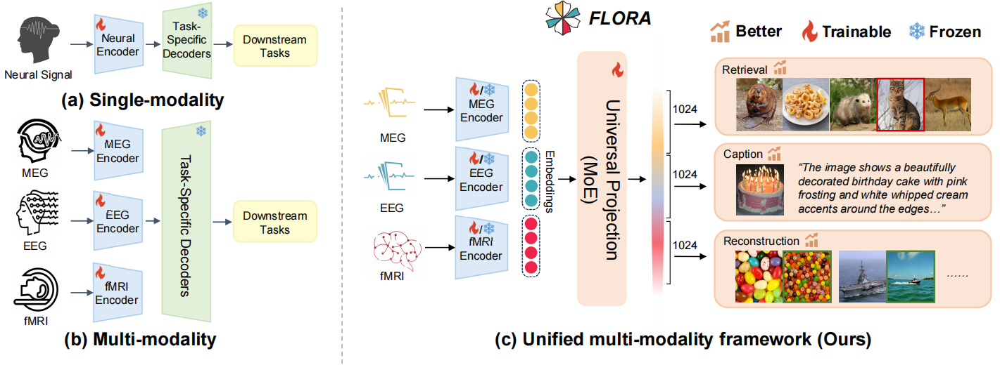
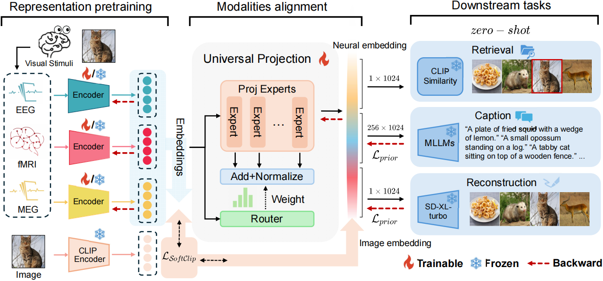

# FLORA
FLORA: A Unified Generalist Model for Visual Brain Decoding via Multi-Modal Neural Embeddings

<!--  -->
  

A comparative overview of visual decoding paradigms.

Overall Architecture of FLORA.